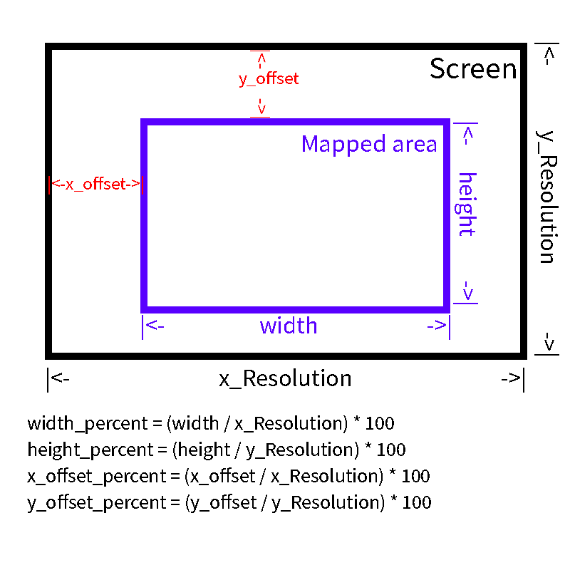

# 10moons-t503-driver

[English](https://github.com/calico-cat-3333/10moons-t503-driver/blob/master/README.md)

简易的 天敏T503 10moons T503 数位板 Linux 驱动

## 关于

驱动提供了 10moons T503 数位板的基本功能:
* 数位板上的 4 个按钮
* 正确的 X Y 坐标
* 压力感应
* 笔上的 2 个按钮（参阅 "笔上的按钮" 章节）
* 屏幕映射

数位板拥有 X Y 两轴各 4080 级和 2047 级压感。

## 笔上的按钮

笔上的按钮在我的设备上工作正常，但我无法保证它在您的设备上也工作正常。

笔上的第二个按钮（带有'-'）可以在官方的 Windows 驱动中配置，修改配置会导致这个驱动无法检测这个按键。所以如果这个驱动无法检测这个按键，您可以打开 Windows上的驱动并重置这个按钮到默认值。

## 如何使用

克隆或下载这个储存库。

```
git clone https://github.com/calico-cat-3333/10moons-t503-driver.git
```

安装列出在 _requirements.txt_ 文件中的所有依赖，可以使用 python 虚拟环境。

```
python3 -m pip install -r requirements.txt
```

对于 Debian 或者 Ubuntu 用户，也可以使用 apt 安装所有依赖。

```
sudo apt install python3-evdev python3-usb python3-yaml
```

将数位板连接到你的电脑并使用 sudo 运行 _driver.py_ 文件。

```
sudo python3 driver.py
```

**你需要先连接数位板并启动驱动然后再打开绘画软件，否则它不会识别设备。**

## 配置数位板

驱动程序的配置项列出在 _config.yaml_ 文件。

### VID & PID

您也许需要修改 *vendor_id* 和 *product_id* 但我不确定（您的设备可以与我的拥有相同的值, 但如果不同您可以运行 *lsusb* 命令以确定您的）。

### Buttons

*tablet_buttons* 的前四项将按照从左到右的顺序分配给数位板上的四个按钮，后两个将被分配给笔上的两个按钮。您可以为它们分配键盘上的任何按钮及其组合，用加号（+）分隔它们。

您可以通过运行下列命令以列出所有按键代码：
```
python3 -c "from evdev import ecodes; print([x for x in dir(ecodes) if 'KEY' in x])"
```

### 交换坐标轴或方向

如果您发现使用此驱动导致您的数位板的轴或方向反转（或者两者都有），您可以将参数 *swap_axis*, *swap_direction_x*, 和 *swap_direction_y* 的值从 false 修改为 true ，反之亦然。

### 屏幕映射

4个参数用于映射屏幕到数位板，数值均为百分比。
* *width_percent* 是映射区域的宽。
* *height_percent* 是映射区域的高。
* *x_offset_percent* 是映射区域左上角相对屏幕左上角的水平距离。
* *y_offset_percent* 是映射区域左上角相对屏幕左上角的垂直距离。

它们的关系如下图所示。



## Credits

部分代码取自: https://github.com/Mantaseus/Huion_Kamvas_Linux

## 已知问题

~~Buttons on the pen itself do not work and hence not specified. I don't know if it's the issue only on my device or it's a common problem.~~
